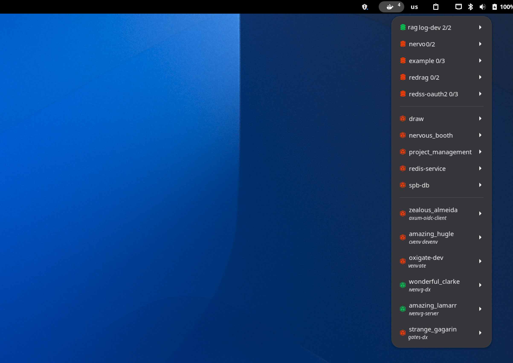

# Easy Docker Containers

This file contains in one place all the required data of the GNOME Shell extension for extensions.gnome.org website to make perfect control of them and keep it in every aspect the up-to-date extraction of main README document.

## Homepage

https://github.com/RedSoftwareSystems/easy_docker_containers

## Icon [^1]



## Screenshot


## Description

```
A GNOME Shell extension (GNOME Panel applet) to be able to generally control your available Docker containers.

----- USAGE -----

The following actions are available from the GNOME Panel menu per Docker container:

- START (COMPOSE) (Will start the services of the related compose project when available.)
- STOP (COMPOSE) (Will stop the services of the related compose project when available.)
- PAUSE (COMPOSE) (Will pause the services of the related compose project when available.)
- RESTART (COMPOSE) (Will restart the services of the related compose project when available.)
- START (Will start the container.)
- STOP (Will stop the container.)
- PAUSE (Will pause the container.)
- RESTART (Will restart the container.)
- EXEC (Will login to the running container interactively through your default terminal application.)
- LOGS (Will start the running container's Docker logs in your default terminal application.)

----- MENU ORGANIZATION PREFERENCES -----

Container entries are sorted automatically, with running containers before stopped containers and names sorted alphabetically within each state. The menu height is constrained to the active monitor's work area, and scrollbars appear only when the list is too long to fit on screen.

The extension preferences include a container display option:

- GROUP CONTAINERS BY TYPE (Separates containers into Docker Compose projects, single instances, and devcontainers — each group divided by a separator. Enabled by default.)

When this option is enabled, the menu is organized into sections divided by separators: Docker Compose projects first, then standalone containers, and finally Dev Container workspaces. Each compose file is collected under a single compose menu that shows the compose project name with a compose-specific icon and a running/total service count, exposes compose-level actions (start, stop, pause, restart) for the whole project, and provides a Services submenu for the individual containers. Running or partially running compose groups appear before fully stopped groups.

----- DEVCONTAINER SUPPORT -----

When a stopped container was created from a Dev Container workspace (i.e. the workspace folder contains a .devcontainer/devcontainer.json), the extension shows additional information and actions:

- The devcontainer name (from devcontainer.json) is displayed as a subtitle under the container entry.
- The workspace folder path is shown as a clickable item — clicking it opens a terminal at that folder.
- START (Runs devcontainer up --workspace-folder <path> to start the container and apply all lifecycle commands.)
- RECREATE AND START (Runs devcontainer up --remove-existing-container --workspace-folder <path> to destroy the existing container and create a fresh one from the image.)

For running devcontainers, an additional action is available:

- OPEN IN IDE (Runs the configured IDE command to attach your editor to the running container.)

These actions require the devcontainer CLI to be installed and reachable on PATH (including version-manager-managed paths such as NVM or pyenv): https://github.com/devcontainers/cli

Open in IDE command:

Configure a shell command in the extension preferences (Devcontainer -> Open in IDE command) to attach your editor to a devcontainer. The command is triggered in two situations:

- Clicking OPEN IN IDE on any running devcontainer.
- Automatically after a successful RECREATE AND START (since recreation replaces the container ID, causing IDEs to lose their connection).

Use %workspaceFolder% as a placeholder for the workspace folder path. Examples:

- VS Code / Cursor: code --folder-uri "vscode-remote://dev-container+$(printf '%s' '%workspaceFolder%' | od -An -tx1 | tr -dc '[:xdigit:]')/workspaceFolder"
- Zed: zed %workspaceFolder% (Zed detects the devcontainer on open and prompts to reopen)
- IntelliJ / JetBrains: No CLI hook available — reconnect manually from inside the IDE.

Leave the field empty to skip this step entirely.

----- PREREQUISITE -----

1. Properly installed and already running Docker service.
2. Corresponding Linux user in `docker` Linux group for manage 'Docker' without `sudo` permission.
3. (Dev Container features only) the devcontainer CLI is installed and on PATH.

----- CREDITS -----

This extension is a fork of gpouilloux's great original 'Gnome Shell extension for Docker' work: https://github.com/gpouilloux/gnome-shell-extension-docker

---- LICENSE -----

GNU - General Public License v3+: https://www.gnu.org/licenses/gpl-3.0.en.html

----- MORE DETAILS -----

https://github.com/RedSoftwareSystems/easy_docker_containers/blob/master/README.md
https://github.com/RedSoftwareSystems/easy_docker_containers/blob/master/CHANGELOG.md
```

---

[^1]: HighRes official GNOME Shell extension like puzzle in GNOME HIG color palette '**Green 5**' color *(#3d3846)* with the extension's GNOME Panel icon in GNOME HIG color palette '**Dark 3**' color *(#3d3846)* rendered in 256x256px with 16px margin.
