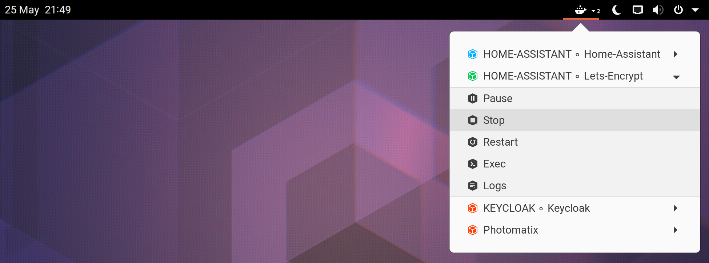

# Easy Docker Containers

A GNOME Shell extension *(GNOME Panel applet)* to be able to generally control your available Docker containers.

## Screenshot

## Usage

The following actions are available from the GNOME Panel menu per Docker container:

- **Start** _(Will start the container.)_
- **Stop** _(Will stop the container.)_
- **Pause** _(Will pause the container.)_
- **Restart** _(Will restart the container.)_
- **Exec** _(Will login to the running container interactively through your default terminal application.)_
- **Logs** _(Will start the running container's Docker logs in your default terminal application.)_

## Prerequisite[^1]

1. Properly installed and already running Docker service.
2. Corresponding Linux user in `docker` Linux group for manage '*Docker*' without `sudo` permission.

[^1]: independently from the extension itself

## Installation

- You can simply install this extension from [it's extensions.gnome.org page](https://extensions.gnome.org/extension/2224/easy-docker-containers)[^2],
  
  [^2]: You could update it from here in the future.
  
- **or** you can pull it from it's GitHub source code repository directly into it's required GNOME Shell directory [^3]

  1.  `git clone https://github.com/RedSoftwareSystems/easy_docker_containers.git ~/.local/share/gnome-shell/extensions/easy_docker_containers@red.software.systems`
  2.  Restart your shell: **[ALT]** + **[F2]** + *'**r**'* + **[Enter]** *(or logout and login again)*
  3.  Enable the extension manually with '***GNOME Extensions***' application *(or with '**GNOME Tweaks**' application)*.
  
  [^3]: DO not change this directory name!

## Contributors

- [kiuma](https://github.com/RedSoftwareSystems)
- [Tamas-Toth-ebola](https://github.com/Tamas-Toth-ebola)
- [jacobfogg](https://github.com/jacobfogg)

## Credits

This extension is a fork of [gpouilloux's](https://github.com/gpouilloux) great original [Gnome Shell extension for Docker](https://github.com/gpouilloux/gnome-shell-extension-docker) work.

## License

[GNU - General Public License v3+](https://www.gnu.org/licenses/gpl-3.0.en.html)